# Security Analysis Dashboard - Mapa de Servicio

## Arquitectura Actual

### Componentes Principales

```
┌─────────────────┐    ┌─────────────────┐    ┌─────────────────┐
│   Frontend      │    │   Backend       │    │   Database      │
│   (Templates)   │◄──►│   (Flask)       │◄──►│   (PostgreSQL)  │
│                 │    │                 │    │                 │
│ - HTML/JS/CSS   │    │ - REST API      │    │ - Projects      │
│ - Bootstrap     │    │ - File Upload   │    │ - Reports       │
│ - Chart.js      │    │ - Report Parser │    │ - JSON Storage  │
└─────────────────┘    └─────────────────┘    └─────────────────┘
```

## API Endpoints Actuales

### 🏠 Gestión de Proyectos

| Método | Endpoint | Descripción | Respuesta |
|--------|----------|-------------|-----------|
| `GET` | `/` | Lista todos los proyectos | HTML (home.html) |
| `GET` | `/create-project` | Formulario nuevo proyecto | HTML (create_project.html) |
| `POST` | `/create-project` | Crear proyecto | Redirect al dashboard |
| `GET` | `/project/{id}` | Dashboard del proyecto | HTML (project_dashboard.html) |
| `POST` | `/project/{id}/delete` | Eliminar proyecto | Redirect a home |

### 📊 Dashboard y Resúmenes

| Método | Endpoint | Descripción | Respuesta |
|--------|----------|-------------|-----------|
| `GET` | `/project/{id}/api/summary` | Resumen de reportes del proyecto | JSON |

### 📤 Carga de Reportes

| Método | Endpoint | Descripción | Formatos Soportados |
|--------|----------|-------------|-------------------|
| `POST` | `/project/{id}/upload` | Subir reporte de seguridad | JSON, XML, HTML |

**Parámetros:**
- `file`: Archivo del reporte
- `report_type`: `sonarqube`, `sbom`, `trivy`

**Respuesta de éxito:**
```json
{
  "success": true,
  "message": "Trivy report processed successfully",
  "data": { /* datos parseados */ }
}
```

### 📋 Vistas Detalladas

| Método | Endpoint | Descripción |
|--------|----------|-------------|
| `GET` | `/project/{id}/sonarqube` | Detalle SonarQube |
| `GET` | `/project/{id}/sbom` | Detalle SBOM |
| `GET` | `/project/{id}/trivy` | Detalle Trivy |

## Estructura de Datos

### Modelo de Proyecto
```python
{
  "id": "uuid",
  "name": "string",
  "created_at": "ISO datetime",
  "reports": {
    "sonarqube": { /* datos parseados */ } | null,
    "sbom": { /* datos parseados */ } | null,
    "trivy": { /* datos parseados */ } | null
  }
}
```

### Parsers Disponibles

#### SonarQube Parser (`parse_sonarqube_report`)
- **Entrada:** JSON
- **Extrae:** bugs, vulnerabilidades, code smells, cobertura, duplicación

#### SBOM Parser (`parse_sbom_report`)
- **Entrada:** JSON/XML (CycloneDX)
- **Extrae:** componentes, vulnerabilidades por severidad, licencias

#### Trivy Parser (`parse_trivy_report` / `parse_trivy_html_report`)
- **Entrada:** JSON/HTML
- **Extrae:** vulnerabilidades por severidad, información de contenedores

## 🔧 Integración con Jenkins

### Opción 1: Jenkins Plugin Personalizado

```groovy
pipeline {
    agent any
    
    stages {
        stage('Security Analysis') {
            parallel {
                stage('SonarQube Scan') {
                    steps {
                        script {
                            withSonarQubeEnv('SonarQube') {
                                sh 'mvn sonar:sonar -Dsonar.projectKey=${PROJECT_KEY}'
                            }
                            
                            // Obtener reporte JSON
                            sh 'curl -u ${SONAR_TOKEN}: "${SONAR_URL}/api/measures/component?component=${PROJECT_KEY}&metricKeys=bugs,vulnerabilities,code_smells,coverage" > sonarqube-report.json'
                        }
                    }
                }
                
                stage('SBOM Generation') {
                    steps {
                        sh 'syft packages . -o cyclonedx-json > sbom-report.json'
                    }
                }
                
                stage('Container Scan') {
                    steps {
                        sh 'trivy image --format json --output trivy-report.json ${DOCKER_IMAGE}'
                        // También generar HTML para casos de uso específicos
                        sh 'trivy image --format table --output trivy-report.html ${DOCKER_IMAGE}'
                    }
                }
            }
        }
        
        stage('Upload to Security Dashboard') {
            steps {
                script {
                    def projectId = createOrGetProject(env.PROJECT_NAME)
                    
                    // Subir cada reporte
                    uploadReport(projectId, 'sonarqube', 'sonarqube-report.json')
                    uploadReport(projectId, 'sbom', 'sbom-report.json')
                    uploadReport(projectId, 'trivy', 'trivy-report.json')
                    
                    // Notificar resultado
                    echo "Dashboard actualizado: ${DASHBOARD_URL}/project/${projectId}"
                }
            }
        }
    }
}

def createOrGetProject(projectName) {
    def response = httpRequest(
        url: "${DASHBOARD_URL}/api/projects/find-or-create",
        httpMode: 'POST',
        contentType: 'APPLICATION_JSON',
        requestBody: """{"name": "${projectName}"}"""
    )
    return readJSON(text: response.content).project_id
}

def uploadReport(projectId, reportType, fileName) {
    def response = httpRequest(
        url: "${DASHBOARD_URL}/project/${projectId}/upload",
        httpMode: 'POST',
        multipartName: 'file',
        uploadFile: fileName,
        customHeaders: [
            [name: 'Content-Type', value: 'multipart/form-data']
        ],
        formData: [
            [name: 'report_type', body: reportType]
        ]
    )
    
    if (response.status != 200) {
        error("Failed to upload ${reportType} report: ${response.content}")
    }
}
```

### Opción 2: Script Python para Jenkins

```python
#!/usr/bin/env python3
import requests
import os
import sys

class SecurityDashboardClient:
    def __init__(self, base_url, api_key=None):
        self.base_url = base_url.rstrip('/')
        self.session = requests.Session()
        if api_key:
            self.session.headers.update({'Authorization': f'Bearer {api_key}'})
    
    def find_or_create_project(self, name):
        """Busca o crea un proyecto por nombre"""
        response = self.session.post(
            f'{self.base_url}/api/projects/find-or-create',
            json={'name': name}
        )
        response.raise_for_status()
        return response.json()['project_id']
    
    def upload_report(self, project_id, report_type, file_path):
        """Sube un reporte al proyecto"""
        with open(file_path, 'rb') as f:
            files = {'file': f}
            data = {'report_type': report_type}
            
            response = self.session.post(
                f'{self.base_url}/project/{project_id}/upload',
                files=files,
                data=data
            )
            response.raise_for_status()
            return response.json()

# Uso en Jenkins
if __name__ == '__main__':
    dashboard_url = os.environ['DASHBOARD_URL']
    project_name = os.environ['PROJECT_NAME']
    
    client = SecurityDashboardClient(dashboard_url)
    project_id = client.find_or_create_project(project_name)
    
    # Subir reportes disponibles
    reports = [
        ('sonarqube', 'sonarqube-report.json'),
        ('sbom', 'sbom-report.json'),
        ('trivy', 'trivy-report.json')
    ]
    
    for report_type, file_path in reports:
        if os.path.exists(file_path):
            try:
                result = client.upload_report(project_id, report_type, file_path)
                print(f"✓ {report_type} uploaded successfully")
            except Exception as e:
                print(f"✗ Failed to upload {report_type}: {e}")
                sys.exit(1)
    
    print(f"Dashboard available at: {dashboard_url}/project/{project_id}")
```

## 🚀 APIs Adicionales Necesarias para Jenkins

Para una integración completa con Jenkins, necesitamos añadir estos endpoints:

### 1. API de Proyectos por Nombre
```http
POST /api/projects/find-or-create
Content-Type: application/json

{
  "name": "mi-proyecto"
}
```

### 2. API de Estado del Proyecto
```http
GET /api/projects/{id}/status
```

### 3. Webhook para Notificaciones
```http
POST /api/projects/{id}/webhook
Content-Type: application/json

{
  "event": "scan_completed",
  "build_number": "123",
  "jenkins_url": "https://jenkins.example.com/job/my-project/123"
}
```

## 🔄 Flujo de Integración Completo

```mermaid
sequenceDiagram
    participant J as Jenkins
    participant S as SonarQube
    participant T as Trivy
    participant SY as Syft
    participant D as Security Dashboard
    participant DB as PostgreSQL

    J->>S: Ejecutar análisis de código
    S-->>J: Reporte JSON
    
    J->>SY: Generar SBOM
    SY-->>J: Reporte CycloneDX
    
    J->>T: Escanear contenedor
    T-->>J: Reporte JSON/HTML
    
    J->>D: POST /api/projects/find-or-create
    D->>DB: Buscar/crear proyecto
    DB-->>D: Project ID
    D-->>J: Project ID
    
    J->>D: POST /project/{id}/upload (SonarQube)
    D->>DB: Guardar reporte parseado
    
    J->>D: POST /project/{id}/upload (SBOM)
    D->>DB: Guardar reporte parseado
    
    J->>D: POST /project/{id}/upload (Trivy)
    D->>DB: Guardar reporte parseado
    
    J->>D: POST /api/projects/{id}/webhook
    D-->>J: Confirmación
```



## 📈 Beneficios de la Integración

1. **Automatización Completa**: Los reportes se generan y suben automáticamente en cada build
2. **Histórico Centralizado**: Todos los análisis de seguridad en un solo lugar
3. **Visibilidad**: Dashboards unificados para todos los proyectos
4. **Alertas**: Posibilidad de configurar notificaciones por cambios en métricas
5. **Trazabilidad**: Conexión directa entre builds de Jenkins y análisis de seguridad

Esta arquitectura permite una integración fluida entre Jenkins y el dashboard de seguridad, manteniendo la trazabilidad completa del proceso de análisis.